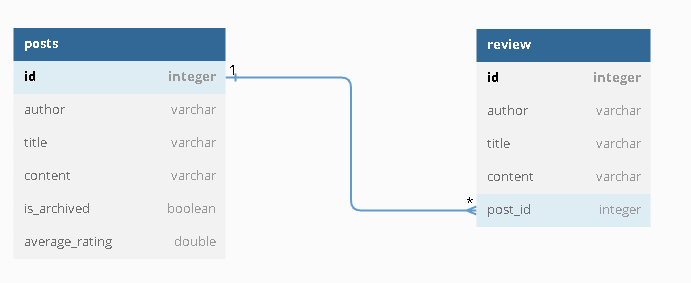
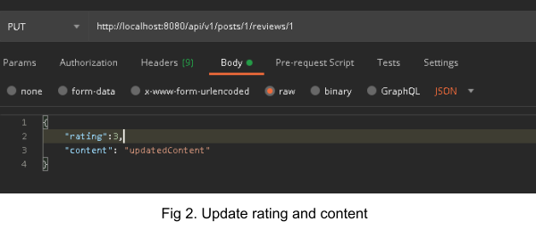
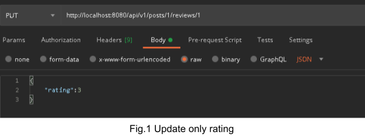

# Blogging-engine RESTful API v0.0.1

This application is a simple blogging-engine API which allows (as the name says) handling most of the basics features of blogs. _It does not contain any UI._

## Features:

- add new post
- get post
- get all created posts
- update post
- review post
- delete review
- update review
- get all review for one post

## Technology stack:

- Java 17
- Spring Boot 3.0.5 (**_works only with Java 17_**)
- Spring Data JPA Hibernate
- Hibernate

## Database:

- H2 (in memory)

## Tools:

- Maven

## Docs API:

- Swagger

## Entity relationship:

**one-to-many**

Following blog features, the post can have 1 or more reviews.

## How to run it:

Before we launch the application (e.g in IDE) we should run two maven commands: **clean** and **install**. It is caused by automatic mapping. Without this action we can expect errors.

The running application is pretty much automative. Database H2 will be created at the start by Hibernate and deleted with all data after closing the application.

## Documentation:

Every endpoint is described. It is possible with **_Swagger_** under followed link: [_http://localhost:8080/swagger-ui/index.html_](http://localhost:8080/swagger-ui/index.html)

## How it works:

The application has two rules which have to be followed to get the expected result.

1. The post can be archived and to that post review cannot be added.
2. The review can only be added one per author for post.

It is quite important to mention about updating posts as well for both - review and post. We can update as many modificable fields as we want, for example:

- we can modify only rating (fig.1)
- we can modify rating and content (fig 2)

